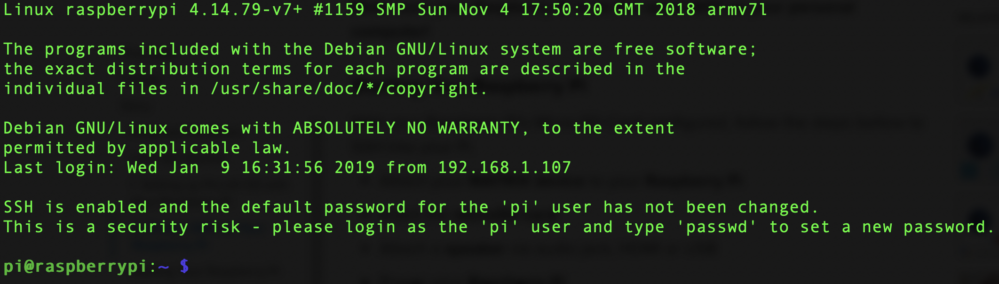

# Pre-Workshop Setup
Follow this section to prepare all the necessary hardware and software so you can follow along with the Arm DevDay MATRIX Workshop.

## Required Hardware
- Everything inside the [MATRIX Workshop Kit](https://events.hackster.io/armdevday#page-block-00wo26qig3709lbmb85p63whfr).
- Personal Computer with internet access.
- An audio jack speaker (not required).

## Required Software
- Personal Computer:
  - [Node.js](https://nodejs.org/en/): Dependancy for Sam CLI Tool.
  - [Etcher.io](https://www.balena.io/etcher/): To easily flash our Raspbian Stretch image.
  - Snips' [Sam CLI Tool](https://snips.gitbook.io/getting-started/installation): Creates & manages Snip assistants on your Raspberry Pi.
- Registered [snips.ai](https://snips.ai/) account.

## Raspberry Pi Setup

### 1. Flashing Your Micro SD Card
Before plugging in your Raspberry Pi, you'll need to flash your Micro SD Card. Download our custom [Raspbian Stretch image](https://events.hackster.io/armdevday#page-block-00wo26qig3709lbmb85p63whfr) and open etcher.io to begin flashing.

<details>
<summary>
What's inside our image?
</summary>

Aside from the following dependancies, our image is a slimmed down Raspbian Stretch (Desktop). These dependancies are listed here, if you wish to replicate this in another setup.
- [MATRIX Core](https://matrix-io.github.io/matrix-documentation/matrix-core/getting-started/core-installation/)
- [MATRIX Kernel Modules](https://matrix-io.github.io/matrix-documentation/matrix-creator/resources/microphone/#usage)
- [Snips](https://www.hackster.io/matrix-labs/matrix-voice-and-matrix-creator-running-snips-ai-b48344)
</details>


Once flashed, reinsert the Micro SD Card into your computer. A volume named `boot` should appear. The next step will have you add your WiFi configuration into this volume.

### 2. WiFi Configuration
>**Your Pi must be on the same network as your personal computer.**

>**This step can be skipped if your Raspberry Pi has an ethernet connection.**

Create an empty file on your computer named `wpa_supplicant.conf` and add following information inside:
```
ctrl_interface=DIR=/var/run/wpa_supplicant GROUP=netdev
update_config=1

network={
    ssid="YOU_WIFI_NAME_HERE"
    psk="YOUR_WIFI_PASSWORD_HERE"
}
```

After you verify that your information is correct, drag & drop the file into the `boot` volume. You can now eject and insert the Micro SD Card into your Raspberry Pi. The MATRIX Creator should be attached as well.

### 3. SSH Into Your Raspberry Pi
The following steps will allow you to remotely execute terminal commands to your Raspberry Pi from your computer.

Before powering on, ensure that your setup matches the gif below. Your Raspberry Pi should connect to the WiFi in a few moments. 


It's now time to grab the IP Address of your Pi. If you're not sure how, you can download one of the following network scanners to your smartphone.

<div align="center">
<a href="https://itunes.apple.com/us/app/inet-network-scanner/id340793353?mt=8"></a>
<a href="https://play.google.com/store/apps/details?id=com.overlook.android.fing&hl=en"></a>
</div>

Open an SSH enabled terminal application on your computer:
- **Windows 10**: PowerShell
- **macOS/Linux**: Terminal
- **Windows 7 & 8**: [Download Putty](https://www.putty.org/)

Enter the following command to SSH into your Pi:
```
ssh pi@YOUR.PI.IP.HERE
```
```
#example
ssh pi@192.168.1.129
```

When prompted for a password, type `raspberry` followed by the enter key. Your terminal screen should be similar to the image below.



### 4. Download An SFTP Client (Optional)
We highly recommend installing an SFTP client while following along with the workshop. 

Open an SSH enabled terminal application on your 
- **Windows 7 or later**: [CyberDuck.io](https://cyberduck.io/)
- **macOS**: [CyberDuck.io](https://cyberduck.io/)
- **Linux**: [FileZilla](https://filezilla-project.org/) or mount the Pi as an network drive.

We will be using [CyberDuck.io](https://cyberduck.io/) to edit and upload files with our preferred text editor ([Visual Studio Code](https://code.visualstudio.com/)).

### 5. Good To Go!
You should now be all set to follow along with our workshop for Arm DevDay. Feel free to ask us any questions on our [community site](https://community.matrix.one/) if you have any questions.

Hope to see you **January 22, 2019 9 AM PST**!
