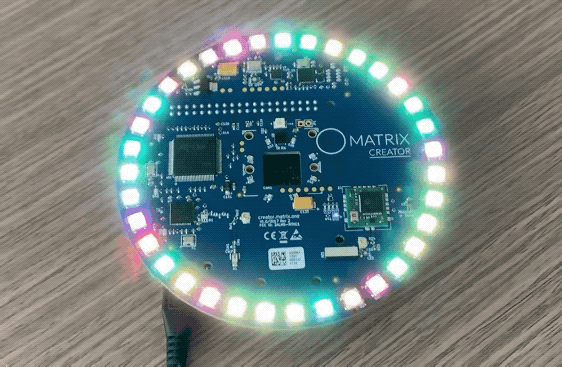
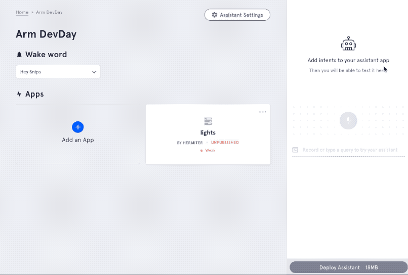
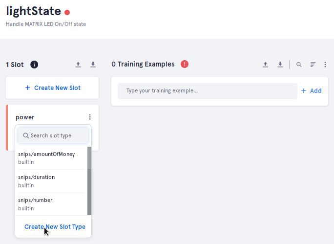
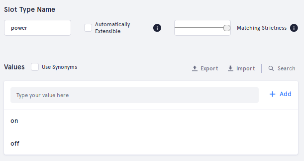
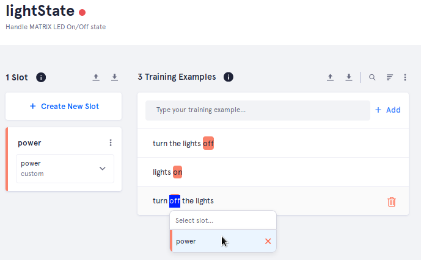
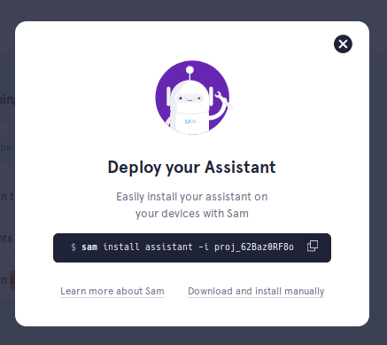
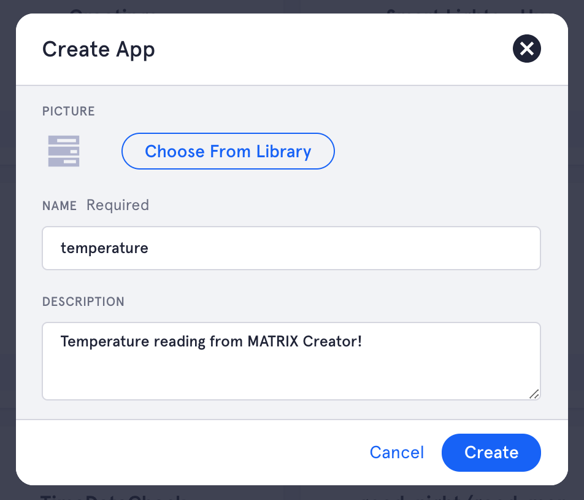
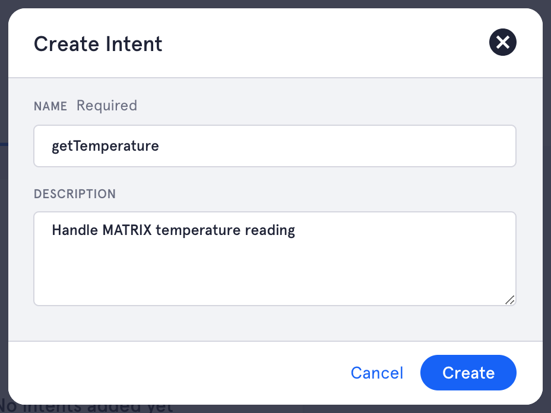
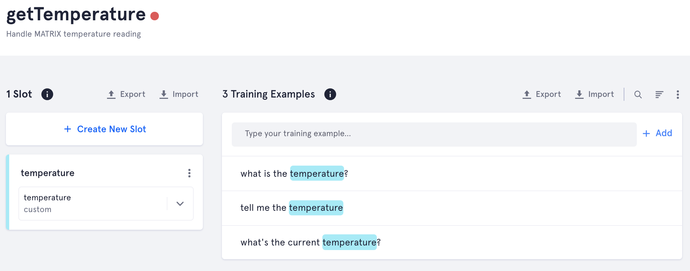

# Workshop Guide
This section will cover everything in our Arm DevDay workshop. Before moving on, make sure that you have everything ready from the [Pre-Workshop Setup](PreWorkshop.md).

## 1. Test MATRIX Core
In your Raspberry Pi's terminal, Enter the commands below to verify that Node.js and MATRIX Core are properly working.

Run Hello World
```bash
cd ~/js-matrix-core-app
node helloWorld.js
```
Your MATRIX Creator should match the image below.

> For your sanity, LED brightness has been lowered.



## 2. Connect Sam To Your Raspberry Pi
By this step, you should have a [snips.ai account](https://console.snips.ai/login) and the [Sam CLI Tool](https://snips.gitbook.io/getting-started/installation) installed.

From your computer's terminal, sign in through the Sam CLI Tool.
```bash
sam login
```

Connect to your Raspberry Pi. When prompted for a username & password, you can press the enter key to insert the default Raspberry Pi credentials.
```bash
sam connect YOUR.PI.IP.HERE
```
Check if Snips is running.
```bash
sam status
```
```
# Example output
# If all services are not (running), use the `sam init` command

Service status:

snips-analytics .............. 0.60.10 (running)
snips-asr .................... 0.60.10 (running)
snips-audio-server ........... 0.60.10 (running)
snips-dialogue ............... 0.60.10 (running)
snips-hotword ................ 0.60.10 (running)
snips-nlu .................... 0.60.10 (running)
snips-skill-server ........... 0.60.10 (running)
snips-tts .................... 0.60.10 (running)
```

Begin viewing the Snips event stream. This will let us verify if your intents are being heard.
```bash
sam watch
```

## 3. Creating assistant.js
This step will go show you how to setup a MATRIX Core project with Snips. `assistant.js` will be used to listen and respond to events from your Snips assistant

**These files will go on your Raspberry Pi.**

Create 2 new JavaScript files.
```bash
cd ~/js-matrix-core-app
touch assistant.js
touch matrix.js
```
MQTT must be installed and used to listen in on events from Snips.
```bash
npm install mqtt --save
```
With all the required dependencies installed, you can now open `assistant.js` & `matrix.js` with your preferred editor (we will be using [VSCode](https://code.visualstudio.com/) through [CyberDuck.io](https://cyberduck.io/)).

Below is an example script for how to set your MATRIX LEDs and listen to Snips MQTT events. 

<details close>
<summary>
assistant.js: Logic for Snips assistant. 
</summary>

```js
// MATRIX functions
var matrix = require(__dirname+'/matrix.js');
// Snips.ai Dependencies
var mqtt = require('mqtt');
var client = mqtt.connect('mqtt://' + '127.0.0.1', { port: 1883 });

// MQTT Topics
var wakeword = 'hermes/hotword/default/detected';
var sessionEnd = 'hermes/dialogueManager/sessionEnded';

// On connection to Snips' MQTT server
client.on('connect', function() {
  console.log('Connected to Snips MQTT server\n');
  // Subscribe to each event (MQTT Topic)
	client.subscribe(wakeword);
  client.subscribe(sessionEnd);
});

// On data from Snips' MQTT server
client.on('message', function(topic, message) {
  switch(topic) {
    // * On Wakeword
    case wakeword:
      matrix.led({blue: 100});
      console.log('Wakeword Detected');
      break;
    // * On Conversation End
    case sessionEnd:
      matrix.led({});
      console.log('Session Ended\n');
      break;
  }
});
```
</details>

<details close>
<summary>
matrix.js: Handy functions for MATRIX Core.
</summary>

```js
// MATRIX Core Dependencies
var zmq = require('zeromq');
var core = require('matrix-protos').matrix_io.malos.v1;
var matrix_ip = '127.0.0.1';
var everloop_base_port = 20021;
var led_count = 35;// # of LEDs on MATRIX device

// - Set MATRIX LEDs to an RGBW color
function led(colors){
  // Create & connect Pusher socket to Base Port
  var configSocket = zmq.socket('push');
  configSocket.connect('tcp://' + matrix_ip + ':' + everloop_base_port);

  // Create an empty Everloop image
  var image = core.io.EverloopImage.create();
  // Set each LED color in Everloop image
  image.led = new Array(led_count).fill(colors);

  // Create MATRIX configuration and add Everloop image
  var config = core.driver.DriverConfig.create({'image': image});
  // Send configuration
  configSocket.send(core.driver.DriverConfig.encode(config).finish());
}

// Export MATRIX functions
module.exports = {
  'led': function(colors){
    led(colors);
  }
}
```
</details>

## 4. Creating A Snips Assistant & App
Sign into your [Snips.ai](https://console.snips.ai/login) and create an assistant. Feel free to choose the wakeword you want. Once created, make a new application named `lights`.


## 5. Adding An Intent To Your App
Intents are what Snips uses to handle user requests. For this Assistant, we'll start by creating an intent for turning On/Off the MATRIX Creator's LEDs.

**Create a new intent called `lightState` for your `lights` app.**



Once you've defined your intent, you need to extract whether the user want their lights `on` or `off`. This is where slots come in.

Create a new slot called `power` and a custom slot type with the same name.



Make sure your `power` slot type has `on` & `off` as values.



Create example sentences containing the words **on** and **off**. Highlight these words in your example sentences to assign them to your recently created `power` slot.



Be sure to save!
> Button is on the bottom right corner of the page.


## 6. Deploying An Assistant & Catching Intents
You can now deploy your assistant! On the bottom right of the page will be a `Deploy Assistant` button.

> If you don't see `Deploy Assistant`, increase your web browser's width.

Use the Sam CLI Tool to deploy the assistant to your Raspberry Pi. Below is an example of the command to use.



The new code added to assistant.js will show you how to listen to `lightState` intents, read slots, and respond to users.

<details close>
<summary>assistant.js</summary>

```js
// MATRIX functions
var matrix = require(__dirname+'/matrix.js');
// Snips.ai Dependencies
var mqtt = require('mqtt');
var client = mqtt.connect('mqtt://' + '127.0.0.1', { port: 1883 });
var snipsUserName = 'YOUR_SNIPS_USERNAME_HERE';//NEW ADDITION

//NEW ADDITION
// - Request Snips session end & utter text given
client.snipsRespond = function(payload){
  client.publish('hermes/dialogueManager/endSession', JSON.stringify({
    sessionId: payload.sessionId,
    text: payload.text
  }));
};

// MQTT Topics
var wakeword = 'hermes/hotword/default/detected';
var sessionEnd = 'hermes/dialogueManager/sessionEnded';
var lightState = 'hermes/intent/'+snipsUserName+':lightState';//NEW ADDITION

// On connection to Snips' MQTT server
client.on('connect', function() {
  console.log('Connected to Snips MQTT server\n');
  // Subscribe to each event (MQTT Topic)
	client.subscribe(wakeword);
  client.subscribe(sessionEnd);
  client.subscribe(lightState);//NEW ADDITION
});

// On data from Snips' MQTT server
var lightsOn = false;//NEW ADDITION
client.on('message', function(topic, message) {
  // Extract message (convert string to JSON)
  var message = JSON.parse(message);//NEW ADDITION

  switch(topic) {
    // * On Wakeword
    case wakeword:
      matrix.led({blue: 100});
      console.log('Wakeword Detected');
      break;
    //NEW ADDITION
    // * On Light State Change
    case lightState:
      // Turn lights On/Off
      try{
        if (message.slots[0].rawValue === 'on'){
          matrix.led({red: 255, green: 69});
          lightsOn = true;
          console.log('Lights On');
        }
        else{
          matrix.led({});
          lightsOn = false;
          console.log('Lights Off');
        }
        // Snips Response
        client.snipsRespond({
          sessionId: message.sessionId, 
          text: 'I have changed the lights!'
        });
      }
      // Expect error if `on` or `off` is not heard
      catch(e){
        console.log('Did receive an On/Off state')
      }
      break;
    // * On Conversation End
    case sessionEnd:
      //NEW ADDITION
      if(lightsOn)
        matrix.led({red: 255, green: 69});
      else
        matrix.led({});
        console.log('Session Ended\n');
      break;
  }
});
```
</details>

Congrats on deploying your Snips assistant! This guide will now build off itself to show you how to incorporate any MATRIX sensor into your assistant.

## 7. Reading A MATRIX Sensor
For your new assistant's skill, this step will add export a function from `matrix.js` to obtain the current temperature value.

The code below is adapted from the [MATRIX Core Humidity example](https://matrix-io.github.io/matrix-documentation/matrix-core/javascript-examples/humidity/).

<details close>
<summary>matrix.js</summary>

```js
// MATRIX Core Dependencies
var zmq = require('zeromq');
var core = require('matrix-protos').matrix_io.malos.v1;
var matrix_ip = '127.0.0.1';
var everloop_base_port = 20021;
var matrix_humidity_base_port = 20017;//NEW ADDITION
var led_count = 35;// # of LEDs on MATRIX device

////////////////////////
// Everloop (LEDs)
///////////////////////
// - Set MATRIX LEDs to an RGBW color
function led(colors){
  // Create & connect Pusher socket to Base Port
  var configSocket = zmq.socket('push');
  configSocket.connect('tcp://' + matrix_ip + ':' + everloop_base_port);

  // Create an empty Everloop image
  var image = core.io.EverloopImage.create();
  // Set each LED color in Everloop image
  image.led = new Array(led_count).fill(colors);

  // Create MATRIX configuration and add Everloop image
  var config = core.driver.DriverConfig.create({'image': image});
  // Send configuration
  configSocket.send(core.driver.DriverConfig.encode(config).finish());
}

//NEW ADDITION
////////////////////////
// TEMPERATURE
///////////////////////
// Create & connect Pusher socket to Base Port
var configSocket = zmq.socket('push');
configSocket.connect('tcp://' + matrix_ip + ':' + matrix_humidity_base_port);

// Create driver configuration
var config = core.driver.DriverConfig.create({
  delayBetweenUpdates: 1.0,// 1 seconds between updates
  timeoutAfterLastPing: 6.0,// Stop sending updates 6 seconds after pings.
  humidity: core.sense.HumidityParams.create({
    currentTemperature: 22// Real current temperature [Celsius] for calibration 
  })
});
// Send driver configuration
configSocket.send(core.driver.DriverConfig.encode(config).finish());

// Create & connect Pusher socket to Keep-Alive Port
var pingSocket = zmq.socket('push');
pingSocket.connect('tcp://' + matrix_ip + ':' + (matrix_humidity_base_port + 1));
// Send ping every 5 seconds
pingSocket.send('');
setInterval(function(){
  pingSocket.send('');
}, 5000);

// Create & connect Subscriber socket to Data Update Port
var updateSocket = zmq.socket('sub');
updateSocket.connect('tcp://' + matrix_ip + ':' + (matrix_humidity_base_port + 3));
// Subscribe to messages
updateSocket.subscribe('');
// On Message
updateSocket.on('message', function(buffer){
  var data = core.sense.Humidity.decode(buffer);// Extract message
    module.exports.temperature = data.temperature;
});

////////////////////////
// EXPORTED FUNCTIONS
///////////////////////
module.exports = {
  'led': function(colors){
    led(colors);
  },
  //NEW ADDITION
  'temperature': 0
}
```
</details>

## 8. Create A Temperature App & Intent
Moving back to your Snips dashboard, add a new app to the assistant you recently created. The app should be named `temperature`.



Add an intent named `getTemperature` to handle user queries for the current temperature.



Almost there! The last step of the `getTemperature` intent is to add a custom slot named `temperature` and a custom value that uses the same name. Be sure to add 3 or more training samples.



You can update your assistant with the following Sam CLI command:

```bash
sam update-assistant
```

## 9. Catching The Temperature Intent
The `assistant.js` code below add a new case, inside the switch statement, to catch a user's request for the current temperature.

<details close>
<summary>assistant.js</summary>

```js
// MATRIX functions
var matrix = require(__dirname+'/matrix.js');
// Snips.ai Dependencies
var mqtt = require('mqtt');
var client = mqtt.connect('mqtt://' + '127.0.0.1', { port: 1883 });
var snipsUserName = 'YOUR_SNIPS_USERNAME_HERE';

// - Request Snips session end & utter text given
client.snipsRespond = function(payload){
  client.publish('hermes/dialogueManager/endSession', JSON.stringify({
    sessionId: payload.sessionId,
    text: payload.text
  }));
};

// MQTT Topics
var wakeword = 'hermes/hotword/default/detected';
var sessionEnd = 'hermes/dialogueManager/sessionEnded';
var lightState = 'hermes/intent/'+snipsUserName+':lightState';
//NEW ADDITION
var getTemperature = 'hermes/intent/'+snipsUserName+':getTemperature';

// On connection to Snips' MQTT server
client.on('connect', function() {
  console.log('Connected to Snips MQTT server\n');
  // Subscribe to each event (MQTT Topic)
	client.subscribe(wakeword);
  client.subscribe(sessionEnd);
  client.subscribe(lightState);
  client.subscribe(getTemperature);//NEW ADDITION
});

// On data from Snips' MQTT server
var lightsOn = false;
client.on('message', function(topic, message) {
  // Extract message (convert string to JSON)
  var message = JSON.parse(message);

  switch(topic) {
    // * On Wakeword
    case wakeword:
      matrix.led({blue: 100});
      console.log('Wakeword Detected');
      break;
    //NEW ADDITION
    // * On Temperature Requested
    case getTemperature:
      // Snips Response
      client.snipsRespond({
        sessionId: message.sessionId, 
        text: 'The current temperature is ' + Math.trunc(matrix.temperature) + ' degrees Celsius.'
      });
      break;
    // * On Light State Change
    case lightState:
      // Turn lights On/Off
      try{
        if (message.slots[0].rawValue === 'on'){
          matrix.led({red: 255, green: 69});
          lightsOn = true;
          console.log('Lights On');
        }
        else{
          matrix.led({});
          lightsOn = false;
          console.log('Lights Off');
        }
        // Snips Response
        client.snipsRespond({
          sessionId: message.sessionId, 
          text: 'I have changed the lights!'
        });
      }
      // Expect error if `on` or `off` is not heard
      catch(e){
        console.log('Did receive an On/Off state')
      }
      break;
    // * On Conversation End
    case sessionEnd:
      if(lightsOn)
        matrix.led({red: 255, green: 69});
      else
        matrix.led({});
        console.log('Session Ended\n');
      break;
  }
});
```
</details>

<!-- ## 10. Workshop Challenge (optional)
Congrats on making it to the end of the workshop! If you want to continue alone, we have a challenge to add a new functionality to your assistant.

What's our challenge? Make a **voice activated night light**!

By using the MATRIX Creator's UV sensor, you can detect the current room lighting and brighten the MATRIX Creator's LEDs to create a dynamic night light. The source code will be included in this repository.

Good Luck! -->